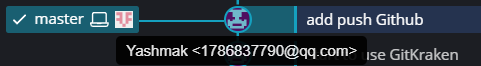

# How to use GitKraken

**可视化版本的Git**

## 对文件操作并保存在本地
1、对于正在编辑的文件，标识是*WIP*（Working in progress）
2、想要提交则需要在右侧对应文件名点击“Stage”（为了防止误操作）
3、Stage后需要在的“Summary”中填入一个描述性的总结信息
4、最后就可以提交

---
## push到github上
设置远程服务器后点击GitKraken界面上的“Push”

---
## 服务器端和本地的同步问题
当远程服务器端和本地的文件同步时，会有master+💻+Github头像

当没有同步时，需要自己“Pull”实现双端的同步

